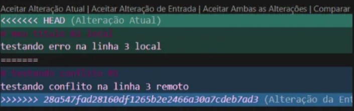

# Comandos git essenciais

   | Comando                             | Descrição                                                   |
   | ------------------------------------| ----------------------------------------------------------- |
   | git init                            | Inicializa um repositório vazio                             |
   | git clone <url>                     | Clona repositório remoto do git hub                         |
   | git remote                          | Lista a url do servidor onde o projeto está salvo           |
   | git status                          | Mostra estado da árvore de trabalho                         |
   | git branch                          | Lista ou cria branches                                      |
   | git checkout -b <nome-da-branch>    | Cria uma nova branch e já muda (faz checkout) pra ela       |
   | git add <arq>                       | Adiciona mudanças ao stage                                  |
   | git commit -m "msg"                 | Registra snapshot                                           |
   | git push                            | Envia commits ao GitHub                                     |
   | git pull                            | Sincroniza e integra mudanças                               |
   | git merge                           | Mescla branches                                             |
   | git log --oneline --graph           | Histórico compacto                                          |
   
 

Durante o desenvolvimento, ao tentar realizar um merge entre duas branches, ocorreu um conflito neste arquivo (README.md).

O Git marcou automaticamente as diferenças para que o desenvolvedor escolha como resolver. As marcações funcionam assim:

<<<<<<< HEAD → mostra a versão local (a que está na sua máquina).

======= → separa as duas versões em conflito.

>>>>>>> hash → mostra a versão remota (a que veio do repositório ou de outra branch).
                                  